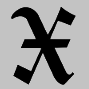

# Sxript
C. 2014-2022



## Browser Instances (use now)

### [Applications](index.php#Applications)

### [Calculator](apps/calculator/)

### [Console](apps/console/)

### [Terminal](apps/terminal/)

***

# Guide

## [0: Introduction](docs/Introduction.html)

> `Sxript is conveyed as open source free software. Do what thou wilt.`

## [1: Numbers and Operators](docs/Numbers-and-Operators.html)

> ` ! ^ * / % + - `

## [2: Quotes (Strings)](docs/Quotes-Strings.html)

> ``` `Hxexlxlxox xWxoxrxlxd' / `x'```

## [3: Vectors (Lists)](docs/Vectors-Lists.html)

> ``` <`hello',<`world',2>,-3-0.14>```

## [4: Operator Overloading](docs/Operator-Overloading.html)

> ``` <`file1.txt',`file2.txt',`file3.txt'> -`.txt'```

## [5: Output Formatting](docs/Output-Formatting.html)

> ``` `Come and see\nthe world\'s finest\n \t...potato!'```

## [6: Code Blocks](docs/Code-Blocks.html)

> ```block({print_`hello '+`world'})```

## [7: Procedural Subsystem](docs/Procedural-Subsystem.html)

> `do`, `loop`, `goto_`, `anchor_`, `if_`

## [8: Recursion and Occlusion](docs/Recursion-and-Occlusion.html)

> `<1+1,(1/(1-1/2)),{5+5}>`

## [9: Introduction to Primitives](docs/Intro-to-Primitives.html)

> `prim(x,y)=z, len(x)=number`

## [10: Index of Types](docs/Type-Index.html)

> `number`, `quote`, `vector`, `occult`, `word`, `etc.`

## [11: Basic Primitives](docs/Basic-Primitives.html)

> `abs`, `cos`, `elem`, `left`, `mid`, `right`, `smooth`, `etc.`

## [12: Apply, Map, Reduce](docs/Apply-Map-Reduce.html)

> `apply(f,v)`, `map(u,f,v)`, `reduce(f,v)`

## [13: Flow-Control Primitives](docs/Flow-Control-Primitives.html)

> `iff(condition,occult1,occult2)`, `for(<j,i,f,d>,occult)`

## [14: Intermission](docs/Intermission.html)

> ```apply(block,<{print_\n `hello ' + :print_`world' \n}>)```

## [15: Variables](docs/Variables.html)

> `let(a,[a]+{b})`

## [16: Boundary Fusion](docs/Boundary-Fusion.html)

> `{abc}{def}, {abcdef}`

## [17: Scope and Subprograms](docs/Scope-and-Subprograms.html)

> ```sub({print_`hello '+`world'})```

## [18: User-Defined Functions](docs/User-Defined-Functions.html)

> `func(name,{[x]...[y]...[z]})`
